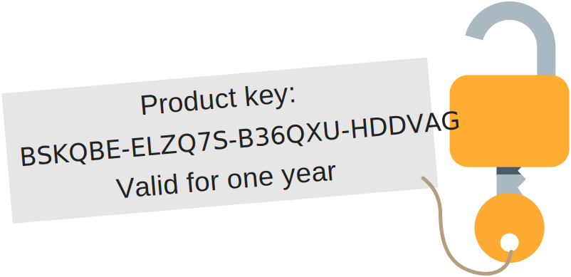

<style type="text/css">
    #bigTitle {
        font-size: 1.5em;
        margin: 1em 0;
		text-align: center;
	}
	
	#bigTitle::before {
		display: none !important;
	}

	.hljs {
		display: block;
		text-align: left;
	}

	.highlight {
		text-align: center;
	}

	.label {
		color: #aaa;
		text-align: center;
		margin-bottom: 0.5em;
	}

    @media screen and (min-width: 42em) {
        #content p,
        #content h2 {
            text-align: center;
        }

        #content h2 {
            margin-top: 80px !important;
		}
		
		.hljs {
			display: inline-block;
			width: 50%;
		}
    }
</style>

<p id="bigTitle">A license system and code obfuscator for Python.</p>

## Integrated in your product

Users will need a valid product key to use your application or service.

{:.noShadow}

<div style="margin: auto; text-align: center">
	<ul style="display: inline-block; max-width: 100%; text-align: left">
		<li>Generate and distribute infinite product keys</li>
		<li>Set arbitrary expiration dates</li>
		<li>Select the features granted by each key separately</li>
		<li>100% offline in-product license validation</li>
	</ul>
</div>

## Getting started

Codeclose is free, open source and distributed under the MIT License.

Read [the documentation](documentation) to learn how to use Codeclose.

<a class="button" href="download"><i class="icon-download"></i> Download</a>

## How does it work?

Codeclose obfuscates source code to make it unreadable for humans and encrypts it to make it unreadable for machines.

Customers can only decrypt and run the code with a valid product key, provided by you.

<div class="label">Original source code</div>
```python
def computeFibonacci(n):
    a, b = 0, 1

    for _ in range(n):
        yield a
        a, b = b, a + b
```
<div style="font-size: 2em; text-align: center; margin-bottom: 0.5em;">🡫</div>
<div class="label">Obfuscated code</div>
```python
def eval_pow(MemoryError_license):
 (ValueError_issubclass, continue_compile) = (0, 1)
 for _all_quit_ in range(MemoryError_license):
  (yield ValueError_issubclass)
  (ValueError_issubclass, continue_compile) = (continue_compile, (ValueError_issubclass + continue_compile))
```
<div style="font-size: 2em; text-align: center; margin-bottom: 0.5em;">🡫</div>
<div class="label">Encrypted code</div>
```python
from ._max_divmod.runtime import IndentationError_SyntaxError
exec(IndentationError_SyntaxError('mHE+isDVh1vos4pTP2Og/wJuh2Q5SNKXSijM4vvyTDvkZPAiF9uv+4+EP6CwlClBsvTLVtdTenTZt2GawvD+wUoqBCk3FCbX4qRelU+cdt5e3K0ukQtlDu2L9DSiYTQ3D0tKuzndXM0zgZA+oR60byhBwQHUivtTSl6Ra7KqmUfLLVspFG/Jx4Tjs1O1OV2YvexOcLEh89qAMOw37dXPngHwASF551DnHe98aK+RD1dq+MZXdCQ4gW7HzQOJBYZsUbA1IUu0GtiO5Uv6Rla7dMqP2xIRRd9T5zvknxdkl6Mt+AEybyOa0LD3aN0jPV9UXY3Vu9ihNRc4zV0KIAYHWjmbVNbHSEhLiPbDG6zJ0L2XYKSKhzOCX3n9Ocksylg/tLgkBQQ3AOQW/68nnun2LQ==', '6VJL8N03wqNwQTejK+oskg==', 297))
```

## Open source -- MIT License

Codeclose is free, open source and distributed under the MIT License.

You are free to adapt it to your needs.

<a class="button" href="https://github.com/juanlao7/codeclose" target="_blank" rel="noopener"><i class="icon-github-circled"></i> Codeclose on Github</a>
